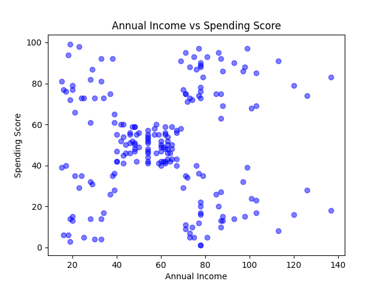

# Mall Customer Segmentation

This project performs customer segmentation on the **Mall Customer Dataset** (from Kaggle) using clustering techniques. The goal is to group customers based on their **Annual Income** and **Spending Score** to identify meaningful customer segments. Both **K-Means** and **DBSCAN** clustering algorithms are applied and compared.


---

## Dataset

- **Source:** Kaggle - Mall Customers Dataset
- **Columns:**
  - `CustomerID` – Unique ID for each customer
  - `Genre` – Gender of the customer
  - `Age` – Age of the customer
  - `AnnualIncome` – Annual income in thousands
  - `SpendingScore` – Score assigned by the mall based on customer spending behavior

---

## Data Preprocessing

1. Loaded the dataset and made a copy for plotting.
2. Scaled `AnnualIncome` and `SpendingScore` using `StandardScaler` to normalize the features for clustering.

```python
scaler = StandardScaler()
customers_data[['AnnualIncome', 'SpendingScore']] = scaler.fit_transform(customers_data[['AnnualIncome', 'SpendingScore']])
````

---

## Exploratory Data Analysis

### Scatter Plot of Annual Income vs Spending Score

This plot helps visualize potential groupings of customers based on income and spending.



---

## K-Means Clustering

1. **Optimal number of clusters** determined using **Silhouette Score** for `k` from 2 to 10.

| k  | Silhouette Score |
| -- | ---------------- |
| 2  | 0.397            |
| 3  | 0.467            |
| 4  | 0.494            |
| 5  | 0.555            |
| 6  | 0.514            |
| 7  | 0.502            |
| 8  | 0.455            |
| 9  | 0.457            |
| 10 | 0.445            |

* Highest Silhouette Score: **0.555** at **k = 5**

2. Applied K-Means clustering with `k=5`.

### K-Means Cluster Visualization


### K-Means Cluster Summary

Average Annual Income and Spending Score per cluster:

| KMeansCluster | AnnualIncome | SpendingScore |
| ------------- | ------------ | ------------- |
| 0             | 55.30        | 49.52         |
| 1             | 86.54        | 82.13         |
| 2             | 25.73        | 79.36         |
| 3             | 88.20        | 17.11         |
| 4             | 26.30        | 20.91         |

---

## DBSCAN Clustering

1. **k-distance graph** used to estimate optimal `eps` parameter for DBSCAN.
2. Tested multiple `eps` values and computed silhouette scores.

| eps  | Clusters | Silhouette Score |
| ---- | -------- | ---------------- |
| 0.30 | 7        | 0.316            |
| 0.35 | 6        | 0.437            |
| 0.40 | 4        | 0.413            |
| 0.45 | 3        | 0.320            |
| 0.50 | 2        | 0.350            |

* Best `eps` = **0.35**, yielding 6 clusters.

### k-distance Graph for DBSCAN


### DBSCAN Cluster Visualization


### DBSCAN Cluster Summary

Average Annual Income and Spending Score per cluster:

| DBSCANClustering | AnnualIncome | SpendingScore |
| ---------------- | ------------ | ------------- |
| -1 (Noise)       | 89.26        | 57.83         |
| 0                | 24.75        | 75.38         |
| 1                | 24.58        | 9.58          |
| 2                | 22.43        | 34.43         |
| 3                | 55.23        | 48.58         |
| 4                | 80.29        | 83.19         |
| 5                | 80.96        | 12.78         |

---

## Observations

* **K-Means** produces well-separated clusters suitable for structured segmentation.
* **DBSCAN** identifies noise and irregular clusters, highlighting outliers in spending behavior.
* Marketing teams can target strategies for:

  * High-income, high-spending customers
  * Low-income, high-spending customers
  * Low-income, low-spending customers
  * Other nuanced clusters identified by DBSCAN

---

## Requirements

* Python 3.8+
* Libraries:

  ```bash
  pip install pandas numpy matplotlib scikit-learn
  ```

---

## Usage

1. Clone the repository.
2. Place the `Mall_Customers.csv` file in the project directory.
3. Run the notebook or script:

   ```bash
   python CustomerSegmentation.py
   ```
4. Plots and cluster summaries will be generated automatically.

---

